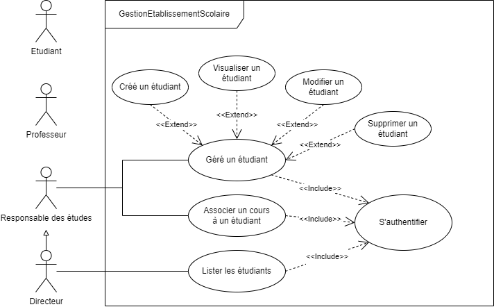

_**Table of contents:**_
- [Diagramme de cas d'utilisation](#diagramme-de-cas-dutilisation)
- [Diagramme de classe](#diagramme-de-classe)
- [Diagramme d'activité pour l'authentification](#diagramme-dactivité-pour-lauthentification)
- [Diagramme d'activité pour l'inscription](#diagramme-dactivité-pour-linscription)
- [Diagramme de sequence](#diagramme-de-sequence)

 
 

# Diagramme de cas d'utilisation

 

# Diagramme de classe

 

# Diagramme d'activité pour l'authentification

 

# Diagramme d'activité pour l'inscription

 

# Diagramme de sequence
